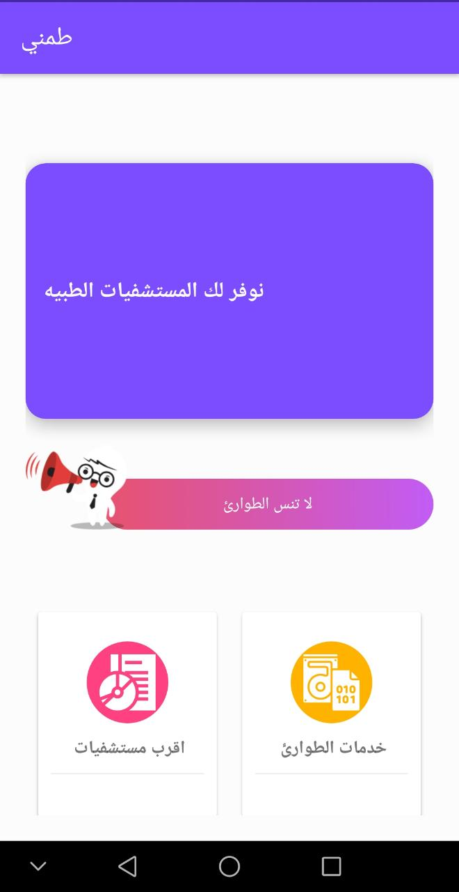

# Corona_Quiz_Android
### Corona App using Sqlite for quiz questions and Firebase for Leaderboard
------------------------------------------------------------------------------------
Android Version 5 

